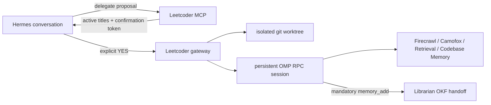

# Leetcoder

Leetcoder lets a live Hermes agent hand a bounded job to a native
[oh-my-pi](https://github.com/can1357/oh-my-pi) session without surrendering
control of the conversation. Each delegation gets an isolated git worktree,
its own persistent OMP session, a visible title, live steering, durable
follow-ups, and a mandatory Librarian handoff.

Nothing starts on the first tool call. Hermes first shows the proposed scope
and every active Leetcoder title; the user must explicitly confirm the second
call.



## What it owns

- two-stage, one-use confirmation before a task begins;
- up to three concurrent root workers by default, each with one OMP-native
  task slot; together with Hermes and Librarian this respects an eight-sequence
  local model ceiling;
- native OMP protocol v2 sessions, steering, follow-ups, and resumption;
- one git branch and worktree per delegation, preserved after completion;
- SQLite lifecycle and event history under `~/.local/share/leetcoder`;
- graceful and force-close semantics with truthful handoff status;
- a required `mcp__librarian_memory_add` OKF handoff after every completed
  implementation or follow-up turn.

Leetcoder does not parse a TUI, call an OpenAI-compatible endpoint, create a
second model configuration, or copy uncommitted source-checkout changes. OMP
receives its ordinary tools and MCP integrations through an isolated profile
cloned from the user's current OMP configuration.

## Requirements

- Debian or another systemd-user Linux environment;
- Bun or Sandwich on `PATH`;
- native `omp`, `hermes`, and `git` commands;
- Librarian registered in OMP before setup. The handoff is a hard completion
  condition, not an optional integration.

## Install

```bash
git clone https://github.com/CommanderTurtle/leetcoder.git ~/Hermes/leetcoder
cd ~/Hermes/leetcoder
bun install
bun run setup
```

Setup performs a frozen Bun install, builds local artifacts, creates the
`leetcoder` OMP profile, installs the user service, registers the Hermes MCP,
installs the small Hermes routing skill, and restarts the Hermes gateway.

The generated paths are deliberately outside git:

```text
~/.config/leetcoder/config.json   lifecycle configuration
~/.config/leetcoder/token         loopback API bearer token
~/.local/share/leetcoder/         database and isolated worktrees
~/.omp/profiles/leetcoder/        autonomous OMP profile
```

## Hermes tools

| Tool | Contract |
|---|---|
| `leetcoder_delegate` | Prepare scope and report active sessions; starts nothing. |
| `leetcoder_confirm` | Consume explicit confirmation and start background work. |
| `leetcoder_list` | List persistent sessions and queued follow-ups. |
| `leetcoder_inspect` | Show lifecycle, recent OMP events, git state, and handoff truth. |
| `leetcoder_steer` | Inject immediate direction into active work. |
| `leetcoder_follow_up` | Queue a serial, persistent turn with its own handoff. |
| `leetcoder_resume` | Reopen a native saved OMP session after pause or completion. |
| `leetcoder_close` | Close while preserving branch/worktree; graceful by default. |

Templates cover implementation, bug fixes, audits, refactors, tests, research,
interactive web work, and source comparisons. They provide execution shape,
not canned answers; the full delegation remains authoritative.

## Operations

```bash
bun run doctor
bun dist/cli.js health
bun dist/cli.js sessions --all
bun dist/cli.js service status
bun dist/cli.js service restart
```

An interrupted gateway marks in-flight sessions `paused` and preserves their
OMP session path. `leetcoder_resume` continues from that native history after
re-reading the worktree. Follow-up messages are stored before execution and
survive service restarts.

Closing never deletes a branch or worktree. Review, merge, archive, or remove
them explicitly with ordinary git commands after the parent Hermes session has
accepted the result.

## Updating

```bash
cd ~/Hermes/leetcoder
git pull --ff-only
bun install --frozen-lockfile
bun run build
bun dist/cli.js service restart
hermes gateway restart
```

Run `bun run setup` again only when profile, MCP registration, or durable paths
change. It is idempotent and keeps the token and existing Leetcoder state.
