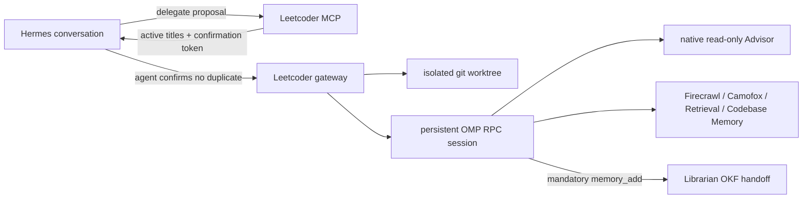

# Leetcoder

Leetcoder lets a live Hermes agent hand a bounded job to a native
[oh-my-pi](https://github.com/can1357/oh-my-pi) session without surrendering
control of the conversation. Each delegation gets an isolated git worktree,
its own persistent OMP session, a visible title, live steering, durable
follow-ups, native Advisor review, and a mandatory Librarian handoff.

Nothing starts on the first tool call. Hermes receives the proposed scope and
every active Leetcoder title, checks for duplicate work itself, and confirms on
the second call. This is agent lifecycle control, not a human permission prompt.



## What it owns

- two-stage, one-use agent confirmation before a task begins, with an exact
  duplicate check at confirmation time;
- up to three concurrent root workers by default, each continuously reviewed by
  OMP's native Advisor; three worker/Advisor pairs plus Hermes and Librarian fit
  the configured eight-sequence local model ceiling;
- native OMP protocol v2 sessions, steering, follow-ups, and resumption;
- one git branch and worktree per delegation, preserved after completion;
- SQLite lifecycle and event history under `~/.local/share/leetcoder`;
- automatic recovery of interrupted turns after a service restart;
- graceful and force-close semantics with truthful handoff status;
- a required `mcp__librarian_memory_add` OKF handoff after every completed
  implementation or follow-up turn.

Leetcoder does not parse a TUI, call an OpenAI-compatible endpoint, create a
second model configuration, or copy uncommitted source-checkout changes. OMP
receives its ordinary tools and MCP integrations through an isolated profile
cloned from the user's current OMP configuration.

## Requirements

- Debian or another systemd-user Linux environment;
- Bun or Sandwich on `PATH`;
- native `omp`, `hermes`, and `git` commands;
- Librarian registered in OMP before setup. The handoff is a hard completion
  condition, not an optional integration.

## Install

```bash
git clone https://github.com/CommanderTurtle/leetcoder.git ~/Hermes/leetcoder
cd ~/Hermes/leetcoder
bun install
bun run setup
```

Setup performs a frozen Bun install, builds local artifacts, creates the
`leetcoder` OMP profile, installs the user service, registers the Hermes MCP,
installs the small Hermes routing skill, and restarts the Hermes gateway.

The generated paths are deliberately outside git:

```text
~/.config/leetcoder/config.json   lifecycle configuration
~/.config/leetcoder/token         loopback API bearer token
~/.local/share/leetcoder/         database and isolated worktrees
~/.omp/profiles/leetcoder/        autonomous OMP profile
```

## Hermes tools

| Tool | Contract |
|---|---|
| `leetcoder_delegate` | `prepare` reports scope and active sessions; `confirm` starts the non-duplicate task with the returned token. |
| `leetcoder_status` | Restore awareness after compaction or inspect one session, always including objective, current activity, and draft location. |
| `leetcoder_steer` | Steer live work immediately or durably resume/queue direction behind the same simple call. |
| `leetcoder_stop` | Stop while preserving branch/worktree; graceful by default. |

Templates cover implementation, bug fixes, audits, refactors, tests, research,
interactive web work, and source comparisons. They provide execution shape,
not canned answers; the full delegation remains authoritative.

## Operations

```bash
bun run doctor
bun dist/cli.js health
bun dist/cli.js sessions --all
bun dist/cli.js service status
bun dist/cli.js service restart
```

An interrupted gateway marks in-flight sessions `paused`, preserves their OMP
session path, and automatically queues a recovery turn after restart. Steering
and follow-up messages are stored before deferred execution and survive service
restarts. `leetcoder_status` reconstructs the whole control view after Hermes
compaction from SQLite rather than relying on conversation memory.

The Leetcoder profile enables OMP's native Advisor at the persisted profile and
every headless RPC launch. The runtime flag matters because OMP intentionally
resets workflow-altering Advisor/task/memory settings to safe defaults in RPC
mode. Advisor subagents remain disabled: each root worker gets one passive,
read-only reviewer rather than an uncontrolled review tree.

Closing never deletes a branch or worktree. Review, merge, archive, or remove
them explicitly with ordinary git commands after the parent Hermes session has
accepted the result.

## Updating

```bash
cd ~/Hermes/leetcoder
git pull --ff-only
bun install --frozen-lockfile
bun run build
bun dist/cli.js service restart
hermes gateway restart
```

Run `bun run setup` again only when profile, MCP registration, or durable paths
change. It is idempotent and keeps the token and existing Leetcoder state.
